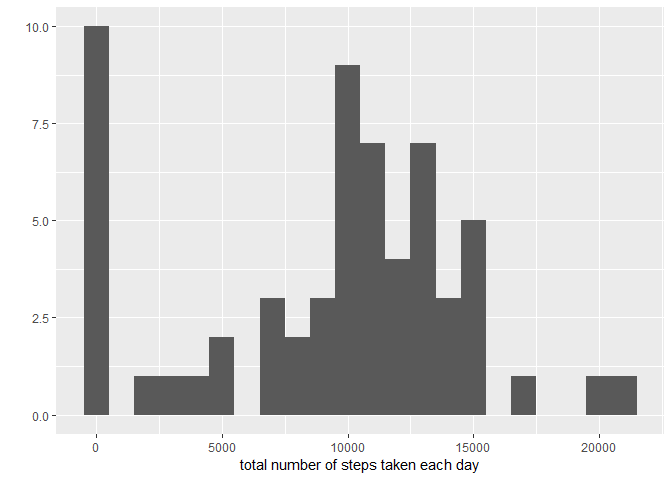
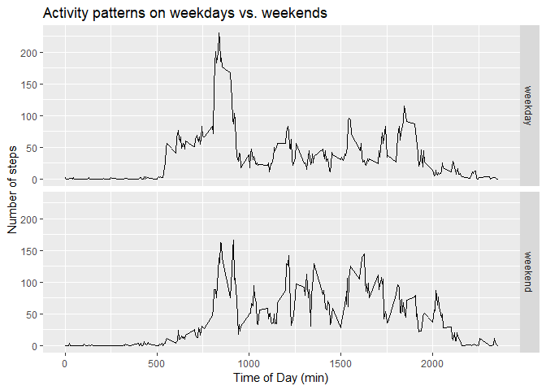
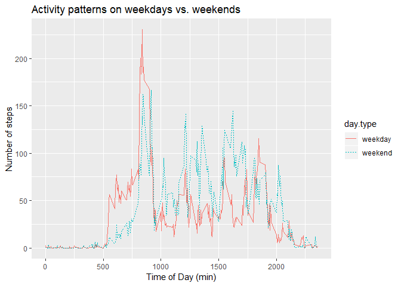

Loading the usual libraries


Donwloading data from source, saving it and loading it with R

```r
furl <- 'https://d396qusza40orc.cloudfront.net/repdata%2Fdata%2Factivity.zip'
filename <- "getdata_dataset.zip"
download.file(furl,filename,mode='wb', method='auto')
unzip(filename) 
df <- read.table('./activity.csv', sep = ",", header=TRUE)
```

Converting date column into dateformat

```r
df$date <- as.character(df$date)
df$date <- as.Date(df$date, "%Y-%m-%d")
head(df)
```

```
##   steps       date interval
## 1    NA 2012-10-01        0
## 2    NA 2012-10-01        5
## 3    NA 2012-10-01       10
## 4    NA 2012-10-01       15
## 5    NA 2012-10-01       20
## 6    NA 2012-10-01       25
```

Checking some preliminary informations about the dataset

```r
summary(df)
```

```
##      steps             date               interval     
##  Min.   :  0.00   Min.   :2012-10-01   Min.   :   0.0  
##  1st Qu.:  0.00   1st Qu.:2012-10-16   1st Qu.: 588.8  
##  Median :  0.00   Median :2012-10-31   Median :1177.5  
##  Mean   : 37.38   Mean   :2012-10-31   Mean   :1177.5  
##  3rd Qu.: 12.00   3rd Qu.:2012-11-15   3rd Qu.:1766.2  
##  Max.   :806.00   Max.   :2012-11-30   Max.   :2355.0  
##  NA's   :2304
```

```r
str(df)
```

```
## 'data.frame':	17568 obs. of  3 variables:
##  $ steps   : int  NA NA NA NA NA NA NA NA NA NA ...
##  $ date    : Date, format: "2012-10-01" "2012-10-01" ...
##  $ interval: int  0 5 10 15 20 25 30 35 40 45 ...
```
There are 2304 missing values from steps column out of 17658 rows.


# What is mean total number of steps taken per day?

It is possible to obtain the information in two ways:
1) Using group_by on dataset followed by summarise
2) tapply on dataframe$column

```r
sums <- df %>% group_by(date) %>% summarise(steps.sum = sum(steps))
vector.of.sums <- c(sums$steps.sum)

total.steps <- tapply(df$steps, df$date, FUN = sum, na.rm = TRUE)
qplot(total.steps, binwidth = 1000, xlab = "total number of steps taken each day")
```

<!-- -->

Checking mean and median of total.steps removing NA values (note that this is not necessary as in the code above we removed the NAs already)

```r
mean(sums$steps.sum, na.rm=TRUE)
```

```
## [1] NaN
```

```r
mean(total.steps, na.rm = TRUE)
```

```
## [1] 9354.23
```

```r
median(total.steps, na.rm = TRUE)
```

```
## [1] 10395
```

# What is the average daily activity pattern?

```r
averages <- aggregate(x = list(steps = df$steps), by = list(interval = df$interval), 
    FUN = mean, na.rm = TRUE)
ggplot(data = averages, aes(x = interval, y = steps)) + geom_line() + xlab("5-minute interval") + 
    ylab("average number of steps taken")
```

<!-- -->

On average across all the days in the dataset, the 5-minute interval contains the maximum number of steps?


```r
averages[which.max(averages$steps), ]
```

```
##     interval    steps
## 104      835 206.1698
```

# Imputing missing values

One possible solution to restore values is to fill them with averages from interval time


```r
# Replace each missing value with the mean value of its 5-minute interval
fill.value <- function(steps, interval) {
    filled <- NA
    if (!is.na(steps)) 
        filled <- c(steps) else filled <- (averages[averages$interval == interval, "steps"])
    return(filled)
}
filled.data <- df
filled.data$steps <- mapply(fill.value, filled.data$steps, filled.data$interval)
```

Now, using the filled data set: histogram of the total number of steps taken each day and calculate the mean and median total number of steps.


```r
total.steps <- tapply(filled.data$steps, filled.data$date, FUN = sum)
qplot(total.steps, binwidth = 1000, xlab = "total number of steps taken each day")
```

<!-- -->

Checking mean.

```r
mean(total.steps)
```

```
## [1] 10766.19
```

```r
mean(filled.data$steps)
```

```
## [1] 37.3826
```

# Are there differences in activity patterns between weekdays and weekends?

We can use a function to map which days in a particular date are weekdays and store it as a variable
the language system is italian so:
saturday = sabato
sunday = domenica

```r
daytype <- function(date) 
    if (weekdays(date) %in% c("sabato", "domenica")) "weekend" else "weekday"
filled.data$day.type <- as.factor(sapply(filled.data$date, daytype))
```

Now that we have our variable, we can plot the new data


```r
steps.day.daytype <- ddply(filled.data, .(interval, day.type),
                           summarize, steps=mean(steps))
ggplot(steps.day.daytype, aes(interval, steps)) + 
    geom_line() + facet_grid(day.type ~ .) +
    labs(x="Time of Day (min)", y="Number of steps",
         title="Activity patterns on weekdays vs. weekends")
```

<!-- -->
         
         
Now, let's make a panel plot containing plots of average number of steps taken on weekdays and weekends.

```r
ggplot(steps.day.daytype, aes(interval, steps)) + 
    geom_line(aes(color=day.type, linetype=day.type)) +
    labs(x="Time of Day (min)", y="Number of steps",
         title="Activity patterns on weekdays vs. weekends")
```

<!-- -->
